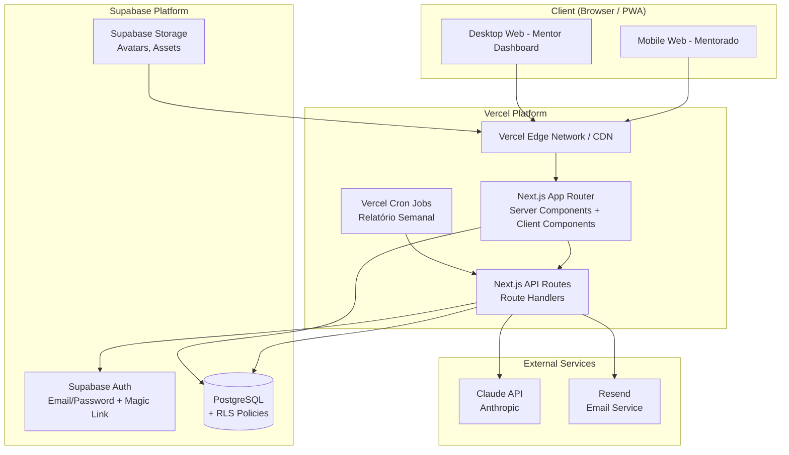
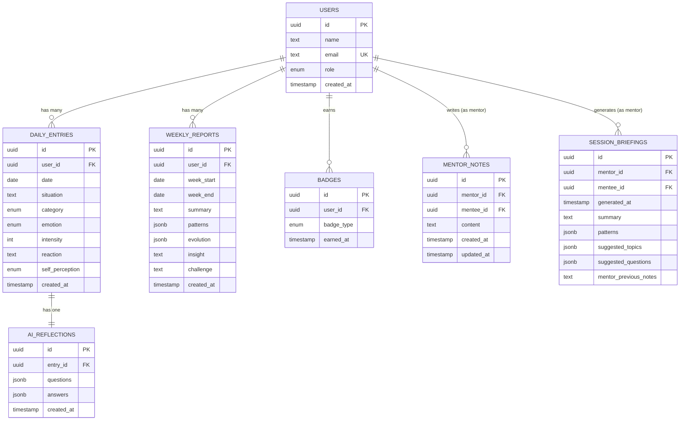
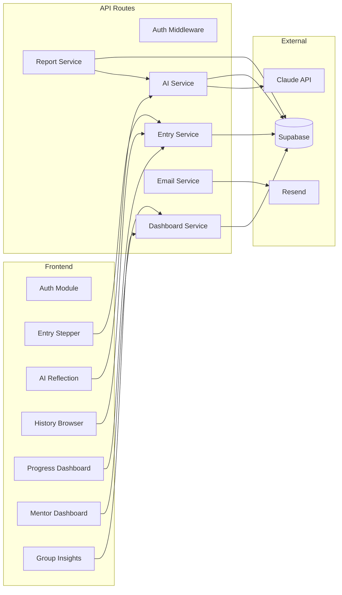
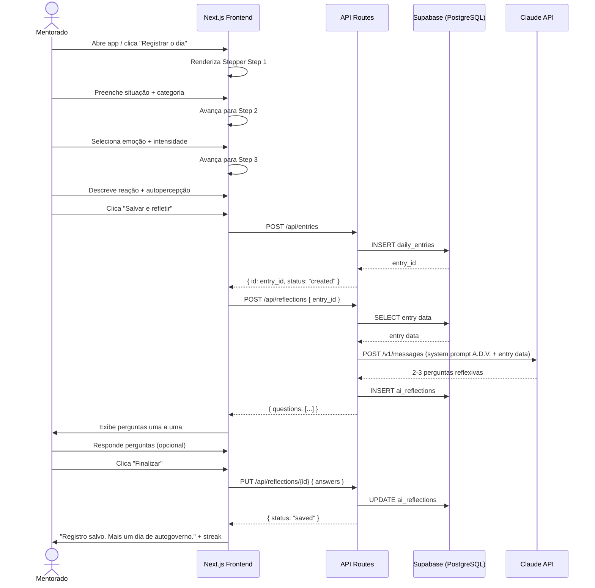
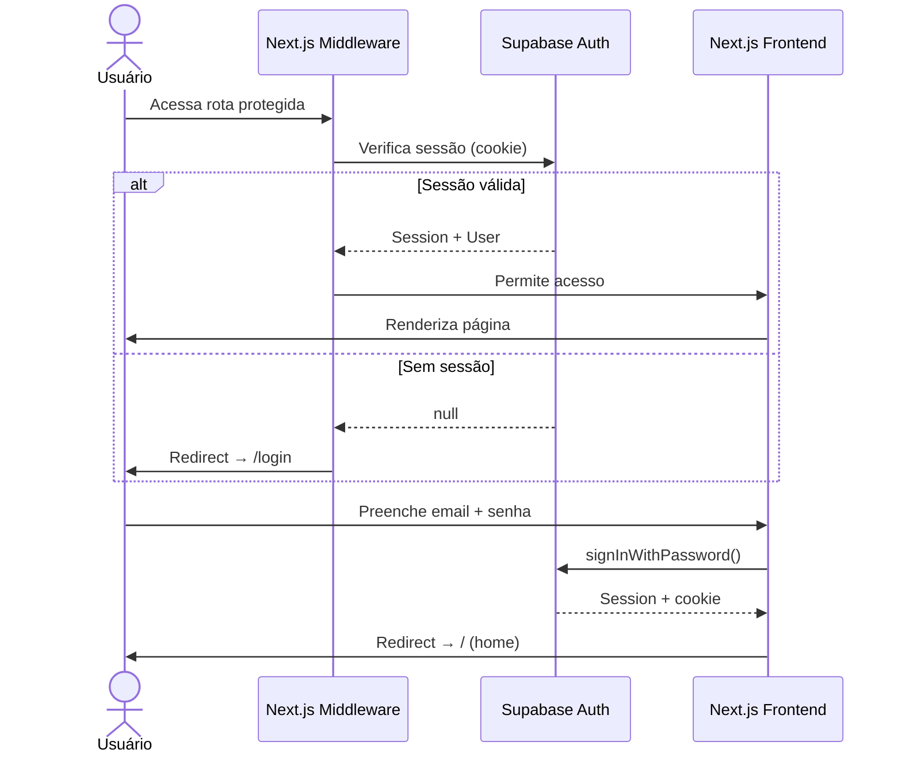
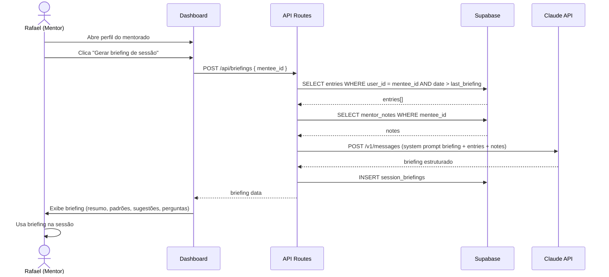
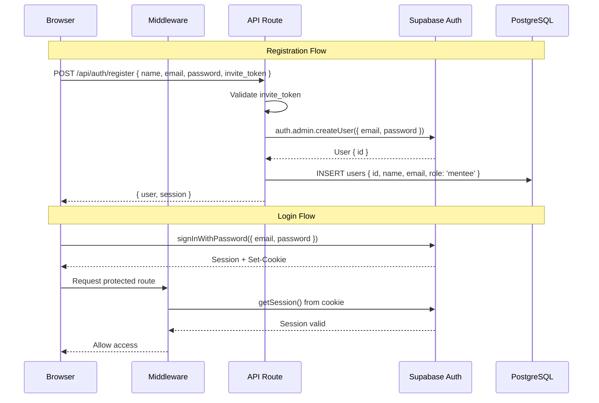

# Diário de Autogoverno — Fullstack Architecture Document

## Introduction

Este documento define a arquitetura completa fullstack para o **Diário de Autogoverno**, cobrindo backend, frontend e integração. Serve como fonte única de verdade para o desenvolvimento orientado por IA, garantindo consistência em toda a stack.

### Starter Template

N/A — Greenfield project. Stack definido no PRD: Next.js 14+ (App Router), Supabase, Claude API, Vercel.

### Change Log

| Date | Version | Description | Author |
|------|---------|-------------|--------|
| 2026-02-27 | 1.0 | Criação inicial | Aria (Architect) |

---

## High Level Architecture

### Technical Summary

O Diário de Autogoverno é uma aplicação fullstack monolítica construída com Next.js 14+ usando App Router, deployada na Vercel. O frontend é mobile-first para mentorados e desktop-first para o mentor dashboard, ambos servidos pelo mesmo projeto Next.js. O backend utiliza API Routes (Route Handlers) do Next.js para lógica server-side, incluindo integração com Claude API para geração de reflexões e relatórios. O Supabase fornece PostgreSQL gerenciado com Row Level Security (RLS), autenticação nativa, e real-time capabilities. A arquitetura é deliberadamente simples — monolith sobre serverless — otimizada para o escopo do MVP (~15 telas, 1 mentor, 20-50 mentorados) com caminho claro de evolução.

### Platform and Infrastructure

**Platform:** Vercel + Supabase
**Key Services:** Vercel (hosting, serverless functions, cron jobs, edge network), Supabase (PostgreSQL, Auth, RLS, Storage)
**Deployment Regions:** Vercel auto (GRU - São Paulo recomendado), Supabase South America East

### Repository Structure

**Structure:** Monorepo simplificado (single Next.js project)
**Monorepo Tool:** N/A — projeto único em `packages/web/`
**Package Organization:** Convenção AIOS com `packages/web/` como aplicação principal

```
packages/web/          → Next.js app (frontend + API routes)
docs/                  → Stories, PRD, architecture
tests/                 → Unit + integration tests
supabase/              → Migrations, seed data, config
```

### High Level Architecture Diagram



### Architectural Patterns

- **Monolith Serverless:** Frontend e backend no mesmo projeto Next.js, deployado como serverless functions na Vercel — _Rationale:_ Simplicidade operacional, zero infra para gerenciar, adequado para escopo do MVP
- **Server Components First:** React Server Components por padrão, Client Components apenas para interatividade — _Rationale:_ Menor bundle size, melhor performance, dados carregados no servidor sem waterfalls
- **BaaS (Backend as a Service):** Supabase como camada de dados com PostgreSQL + Auth + RLS — _Rationale:_ Elimina necessidade de gerenciar infraestrutura de banco e autenticação
- **Repository Pattern (simplificado):** Funções de acesso a dados em `lib/db/` que abstraem queries Supabase — _Rationale:_ Isolamento de lógica de dados, testabilidade, futuras migrações facilitadas
- **Service Layer:** Lógica de negócio em `lib/services/` separada dos route handlers — _Rationale:_ Reusabilidade entre API routes e Server Components
- **API Route Handlers:** REST-like endpoints em `app/api/` para operações mutáveis — _Rationale:_ Padrão nativo do Next.js, familiar, bem documentado

---

## Tech Stack

| Category | Technology | Version | Purpose | Rationale |
|----------|-----------|---------|---------|-----------|
| Frontend Language | TypeScript | 5.x | Type safety fullstack | Tipos compartilhados entre frontend e backend |
| Frontend Framework | Next.js | 14+ | App Router, SSR, API Routes | Stack definido, monolith fullstack em um projeto |
| UI Component Library | shadcn/ui | latest | Componentes base acessíveis | Componentes copiados (não dependência), customizáveis com Tailwind |
| State Management | Zustand + React Query | 4.x / 5.x | Estado global + server state | Zustand para UI state mínimo, React Query para cache e sync com servidor |
| Backend Language | TypeScript | 5.x | API Routes, server logic | Mesma linguagem frontend/backend, tipos compartilhados |
| Backend Framework | Next.js API Routes | 14+ | Route Handlers serverless | Zero config adicional, deploy automático na Vercel |
| API Style | REST-like | - | Route Handlers com JSON | Simplicidade, padrão do Next.js App Router |
| Database | PostgreSQL | 15+ | Dados relacionais + RLS | Via Supabase, RLS nativo para segurança por row |
| Cache | React Query cache + Vercel | - | Client-side data cache | React Query para deduplicação e revalidação automática |
| File Storage | Supabase Storage | - | Avatars, assets | Integrado com auth, CDN automático |
| Authentication | Supabase Auth | - | Email/password, magic link | RLS integrado, session management automático |
| AI Integration | Anthropic Claude API | claude-sonnet-4-20250514 | Reflexões, relatórios, briefings | Modelo definido pelo cliente, server-side only |
| Frontend Testing | Jest + React Testing Library | 29.x / 14.x | Unit tests de componentes | Padrão da indústria para React |
| Backend Testing | Jest | 29.x | Unit + integration de API routes | Mesmo framework, consistência |
| E2E Testing | Playwright | latest | Testes end-to-end (fase posterior) | Melhor suporte a modern web apps |
| Build Tool | Next.js built-in | 14+ | Build + bundle | Turbopack em dev, Webpack em prod |
| CSS Framework | Tailwind CSS | 3.x | Utility-first styling | Produtividade, dark mode nativo, consistência |
| Charts | Recharts | 2.x | Gráficos de evolução | Composable, React-native, responsivo |
| Email | Resend | - | Lembretes diários | Integração nativa Vercel, DX excelente |
| PWA | next-pwa | latest | Instalação mobile | Manifest + service worker com zero config |
| CI/CD | Vercel + GitHub Actions | - | Deploy automático | Preview deploys, auto-deploy em push |
| Linting | ESLint | 8.x | Code quality | Configuração Next.js padrão |
| Formatting | Prettier | 3.x | Code formatting | Consistência automática |

---

## Data Models

### User

**Purpose:** Representa um usuário do sistema — mentorado ou mentor (Rafael). O role `mentor` herda TODAS as funcionalidades de `mentee`.

**Key Attributes:**
- `id`: UUID — Identificador único (Supabase Auth UID)
- `name`: string — Nome completo
- `email`: string — Email único
- `role`: enum (mentee | mentor) — Define nível de acesso
- `created_at`: timestamp — Data de criação

```typescript
interface User {
  id: string;           // UUID from Supabase Auth
  name: string;
  email: string;
  role: 'mentee' | 'mentor';
  created_at: string;   // ISO 8601
}
```

**Relationships:**
- Has many `DailyEntry`
- Has many `WeeklyReport`
- Has many `MentorNote` (as mentor)
- Has many `SessionBriefing` (as mentor)

### DailyEntry

**Purpose:** Registro diário do mentorado — situação de pressão, emoção e reação.

**Key Attributes:**
- `id`: UUID — Identificador único
- `user_id`: UUID (FK → users) — Autor do registro
- `date`: date — Data do registro
- `situation`: text — Descrição da situação
- `category`: enum — Tipo de situação
- `emotion`: enum — Emoção predominante
- `intensity`: integer (1-10) — Intensidade emocional
- `reaction`: text — Como reagiu
- `self_perception`: enum — Autopercepção
- `created_at`: timestamp

```typescript
type Category = 'audiencia' | 'negociacao' | 'cliente' | 'cobranca' | 'equipe' | 'decisao' | 'outro';
type Emotion = 'ansiedade' | 'raiva' | 'medo' | 'frustracao' | 'inseguranca' | 'culpa' | 'outro';
type SelfPerception = 'reactive' | 'strategic' | 'unsure';

interface DailyEntry {
  id: string;
  user_id: string;
  date: string;           // YYYY-MM-DD
  situation: string;
  category: Category;
  emotion: Emotion;
  intensity: number;       // 1-10
  reaction: string;
  self_perception: SelfPerception;
  created_at: string;
}
```

**Relationships:**
- Belongs to `User`
- Has one `AIReflection`

### AIReflection

**Purpose:** Perguntas reflexivas geradas pela IA após cada registro, com respostas opcionais do mentorado.

**Key Attributes:**
- `id`: UUID
- `entry_id`: UUID (FK → daily_entries) — Registro associado
- `questions`: json — Array de perguntas geradas pela IA
- `answers`: json (nullable) — Respostas do mentorado (null se não respondeu)
- `created_at`: timestamp

```typescript
interface AIReflection {
  id: string;
  entry_id: string;
  questions: string[];          // 2-3 perguntas
  answers: (string | null)[];   // Respostas opcionais, null se não respondida
  created_at: string;
}
```

**Relationships:**
- Belongs to `DailyEntry`

### WeeklyReport

**Purpose:** Relatório semanal automático gerado pela IA com análise de padrões.

**Key Attributes:**
- `id`: UUID
- `user_id`: UUID (FK → users)
- `week_start`: date — Início da semana
- `week_end`: date — Fim da semana
- `summary`: text — Resumo narrativo
- `patterns`: json — Padrões identificados
- `evolution`: json — Comparativo com semana anterior
- `insight`: text — Insight principal da semana
- `challenge`: text — Desafio prático para próxima semana
- `created_at`: timestamp

```typescript
interface WeeklyReport {
  id: string;
  user_id: string;
  week_start: string;
  week_end: string;
  summary: string;
  patterns: {
    description: string;
    frequency: number;
    category?: Category;
    emotion?: Emotion;
  }[];
  evolution: {
    avg_intensity_current: number;
    avg_intensity_previous: number;
    reactive_pct: number;
    strategic_pct: number;
  };
  insight: string;
  challenge: string;
  created_at: string;
}
```

**Relationships:**
- Belongs to `User`

### MentorNote

**Purpose:** Notas do mentor sobre cada mentorado para preparação de sessões.

```typescript
interface MentorNote {
  id: string;
  mentor_id: string;
  mentee_id: string;
  content: string;
  created_at: string;
  updated_at: string;
}
```

**Relationships:**
- Belongs to `User` (as mentor)
- References `User` (as mentee)

### SessionBriefing

**Purpose:** Briefing de pré-sessão gerado pela IA para o mentor.

```typescript
interface SessionBriefing {
  id: string;
  mentor_id: string;
  mentee_id: string;
  generated_at: string;
  summary: string;
  patterns: {
    description: string;
    adv_connection: string;  // Conexão com Autogoverno, Direção ou Verdade
  }[];
  attention_points: string[];
  suggested_topics: string[];
  suggested_questions: string[];
  mentor_previous_notes: string;
}
```

**Relationships:**
- Belongs to `User` (as mentor)
- References `User` (as mentee)

### Badge

**Purpose:** Badges de consistência conquistados pelo mentorado.

```typescript
type BadgeType = '7_days' | '30_days' | '90_days' | 'perfect_week';

interface Badge {
  id: string;
  user_id: string;
  badge_type: BadgeType;
  earned_at: string;
}
```

### Entity Relationship Diagram



---

## API Specification

### REST API Endpoints

Base URL: `/api`

#### Authentication

| Method | Endpoint | Purpose | Auth |
|--------|----------|---------|------|
| POST | `/api/auth/register` | Criar conta (com invite token) | Public |
| POST | `/api/auth/login` | Login | Public |
| POST | `/api/auth/logout` | Logout | Authenticated |

#### Daily Entries

| Method | Endpoint | Purpose | Auth |
|--------|----------|---------|------|
| POST | `/api/entries` | Criar registro diário | Mentee/Mentor |
| GET | `/api/entries` | Listar registros do usuário | Mentee/Mentor |
| GET | `/api/entries/[id]` | Detalhes de um registro | Owner |

**Query params (GET /api/entries):**
- `period`: `week` | `month` | `custom`
- `start_date`: ISO date
- `end_date`: ISO date
- `category`: Category enum
- `emotion`: Emotion enum
- `page`: number (default: 1)
- `limit`: number (default: 20)

**Request body (POST /api/entries):**
```json
{
  "date": "2026-02-27",
  "situation": "Audiência tensa com juiz hostil...",
  "category": "audiencia",
  "emotion": "ansiedade",
  "intensity": 8,
  "reaction": "Tentei manter a calma mas...",
  "self_perception": "reactive"
}
```

#### AI Reflections

| Method | Endpoint | Purpose | Auth |
|--------|----------|---------|------|
| POST | `/api/reflections` | Gerar reflexão IA para entry | Mentee/Mentor |
| PUT | `/api/reflections/[id]` | Salvar respostas do mentorado | Owner |

#### Weekly Reports

| Method | Endpoint | Purpose | Auth |
|--------|----------|---------|------|
| POST | `/api/reports/weekly` | Gerar relatório semanal (cron) | System/Cron |
| GET | `/api/reports` | Listar relatórios do usuário | Mentee/Mentor |
| GET | `/api/reports/[id]` | Detalhes de um relatório | Owner |

#### Progress / Stats

| Method | Endpoint | Purpose | Auth |
|--------|----------|---------|------|
| GET | `/api/progress` | Dados de evolução do usuário | Mentee/Mentor |
| GET | `/api/progress/streak` | Streak atual + maior streak | Mentee/Mentor |

#### Mentor Dashboard

| Method | Endpoint | Purpose | Auth |
|--------|----------|---------|------|
| GET | `/api/dashboard/overview` | Resumo geral (cards + alertas) | Mentor |
| GET | `/api/dashboard/mentees` | Lista de mentorados + status | Mentor |
| GET | `/api/dashboard/mentees/[id]` | Perfil completo do mentorado | Mentor |
| GET | `/api/dashboard/mentees/[id]/entries` | Registros do mentorado | Mentor |
| GET | `/api/dashboard/mentees/[id]/patterns` | Padrões IA do mentorado | Mentor |
| GET | `/api/dashboard/insights` | Insights agregados do grupo | Mentor |

#### Mentor Notes

| Method | Endpoint | Purpose | Auth |
|--------|----------|---------|------|
| GET | `/api/mentor-notes/[menteeId]` | Buscar notas do mentorado | Mentor |
| PUT | `/api/mentor-notes/[menteeId]` | Atualizar notas (autosave) | Mentor |

#### Session Briefings

| Method | Endpoint | Purpose | Auth |
|--------|----------|---------|------|
| POST | `/api/briefings` | Gerar briefing pré-sessão | Mentor |
| GET | `/api/briefings/[menteeId]` | Histórico de briefings | Mentor |

---

## Components

### Frontend Components

#### 1. Auth Module
**Responsibility:** Login, cadastro com invite token, proteção de rotas
**Key Interfaces:** `LoginForm`, `RegisterForm`, `AuthProvider`, `useAuth` hook
**Dependencies:** Supabase Auth SDK, Next.js Middleware
**Technology:** Server Components para layout, Client Components para formulários

#### 2. Entry Stepper
**Responsibility:** Formulário guiado de 3 steps para registro diário
**Key Interfaces:** `EntryForm`, `StepSituation`, `StepEmotion`, `StepReaction`, `IntensitySlider`, `CategoryChips`, `EmotionPicker`
**Dependencies:** React Hook Form, Zustand (form state), API route `/api/entries`
**Technology:** Client Components (interatividade), mobile-first, touch-optimized

#### 3. AI Reflection Viewer
**Responsibility:** Exibir perguntas da IA e capturar respostas opcionais
**Key Interfaces:** `ReflectionView`, `QuestionCard`, `AnswerInput`
**Dependencies:** API route `/api/reflections`
**Technology:** Client Component com streaming para loading progressivo

#### 4. History Browser
**Responsibility:** Lista cronológica de registros com filtros e expansão
**Key Interfaces:** `HistoryList`, `EntryCard`, `EntryDetail`, `FilterBar`
**Dependencies:** React Query, API route `/api/entries`
**Technology:** Server Components para lista inicial, Client Components para filtros

#### 5. Progress Dashboard
**Responsibility:** Gráficos de evolução, streaks, badges
**Key Interfaces:** `IntensityChart`, `CategoryPieChart`, `ReactiveVsStrategicChart`, `StreakCounter`, `BadgeGrid`
**Dependencies:** Recharts, API route `/api/progress`
**Technology:** Client Components (Recharts requer client-side rendering)

#### 6. Mentor Dashboard Shell
**Responsibility:** Layout desktop com sidebar, navegação, switch mentor/praticante
**Key Interfaces:** `DashboardLayout`, `Sidebar`, `MentorPractitionerSwitch`
**Dependencies:** Next.js Layout, Auth context
**Technology:** Server Component (layout), Client Component (toggle)

#### 7. Mentee Management
**Responsibility:** Lista de mentorados, perfil individual com abas
**Key Interfaces:** `MenteeList`, `MenteeCard`, `MenteeProfile`, `TabRecords`, `TabEvolution`, `TabReports`, `TabPatterns`, `MentorNotepad`
**Dependencies:** React Query, API routes `/api/dashboard/*`
**Technology:** Mix de Server e Client Components

#### 8. Weekly Report Viewer
**Responsibility:** Renderização do relatório semanal com seções estruturadas
**Key Interfaces:** `ReportView`, `PatternSection`, `EvolutionSection`, `InsightSection`, `ChallengeSection`
**Dependencies:** API route `/api/reports`
**Technology:** Server Components

#### 9. Session Briefing
**Responsibility:** Geração e visualização de briefings pré-sessão
**Key Interfaces:** `BriefingGenerator`, `BriefingView`, `PrintableBriefing`
**Dependencies:** API route `/api/briefings`, CSS print styles
**Technology:** Client Component (geração), Server Component (visualização)

#### 10. Group Insights
**Responsibility:** Painel agregado com métricas do grupo
**Key Interfaces:** `InsightsPanel`, `TopEmotionsChart`, `GroupEvolutionChart`
**Dependencies:** Recharts, API route `/api/dashboard/insights`
**Technology:** Client Components (charts)

### Backend Components

#### 1. Auth Middleware
**Responsibility:** Validação de sessão, proteção de rotas, verificação de role
**Dependencies:** Supabase SSR, Next.js Middleware

#### 2. Entry Service
**Responsibility:** CRUD de registros diários, cálculo de streaks
**Dependencies:** Supabase client, streak logic

#### 3. AI Service
**Responsibility:** Integração com Claude API para reflexões, relatórios e briefings
**Dependencies:** Anthropic SDK (`@anthropic-ai/sdk`), system prompts

#### 4. Report Service
**Responsibility:** Agregação de dados semanais, geração de relatórios via IA
**Dependencies:** AI Service, Entry Service

#### 5. Dashboard Service
**Responsibility:** Agregações para dashboard do mentor, insights de grupo
**Dependencies:** Supabase queries com RLS de mentor

#### 6. Email Service
**Responsibility:** Envio de lembretes diários e notificações
**Dependencies:** Resend SDK

### Component Interaction Diagram



---

## External APIs

### 1. Anthropic Claude API

- **Purpose:** Geração de reflexões pós-registro, relatórios semanais e briefings de pré-sessão
- **Documentation:** https://docs.anthropic.com/en/docs
- **Base URL:** `https://api.anthropic.com/v1`
- **Authentication:** API Key via header `x-api-key` (server-side only, env var `ANTHROPIC_API_KEY`)
- **Rate Limits:** Depende do tier — starter: 50 RPM, build: 1000 RPM

**Key Endpoints Used:**
- `POST /v1/messages` — Gerar reflexões, relatórios e briefings

**Integration Notes:**
- Modelo recomendado: `claude-sonnet-4-20250514` (balanço custo/qualidade)
- Todas as chamadas são server-side (nunca expor API key no client)
- Implementar retry com backoff exponencial para erros 429/529
- Timeout de 30s por request
- Fallback graceful: se a API falhar, registro é salvo sem reflexão

**System Prompts (3 contextos):**

1. **Reflexões pós-registro:** Tom direto, provocativo, framework A.D.V.
2. **Relatório semanal:** Analítico, usa dados reais, identifica padrões
3. **Briefing pré-sessão:** Prático, acionável, prepara o mentor

### 2. Supabase

- **Purpose:** Database PostgreSQL, autenticação, RLS, storage
- **Documentation:** https://supabase.com/docs
- **Base URL:** `https://{project-ref}.supabase.co`
- **Authentication:** Anon Key (client-side) + Service Role Key (server-side)
- **Rate Limits:** Free tier: 500 MB DB, 50k MAU auth, 1 GB storage

**Key Endpoints Used:**
- Auth: `auth.signUp()`, `auth.signInWithPassword()`, `auth.signOut()`
- Database: `from('table').select()`, `.insert()`, `.update()`, `.delete()`
- RPC: `rpc('function_name')` para queries complexas

### 3. Resend

- **Purpose:** Envio de lembretes diários por email
- **Documentation:** https://resend.com/docs
- **Base URL:** `https://api.resend.com`
- **Authentication:** API Key via header `Authorization: Bearer {key}`
- **Rate Limits:** Free tier: 100 emails/dia, 3000/mês

**Key Endpoints Used:**
- `POST /emails` — Enviar email de lembrete

---

## Core Workflows

### 1. Registro Diário Completo



### 2. Login e Proteção de Rotas



### 3. Briefing de Pré-sessão (Mentor)



---

## Database Schema

### DDL (PostgreSQL via Supabase)

```sql
-- Enums
CREATE TYPE user_role AS ENUM ('mentee', 'mentor');
CREATE TYPE entry_category AS ENUM ('audiencia', 'negociacao', 'cliente', 'cobranca', 'equipe', 'decisao', 'outro');
CREATE TYPE entry_emotion AS ENUM ('ansiedade', 'raiva', 'medo', 'frustracao', 'inseguranca', 'culpa', 'outro');
CREATE TYPE self_perception_type AS ENUM ('reactive', 'strategic', 'unsure');
CREATE TYPE badge_type AS ENUM ('7_days', '30_days', '90_days', 'perfect_week');

-- Users (extends Supabase auth.users)
CREATE TABLE public.users (
    id UUID PRIMARY KEY REFERENCES auth.users(id) ON DELETE CASCADE,
    name TEXT NOT NULL,
    email TEXT UNIQUE NOT NULL,
    role user_role NOT NULL DEFAULT 'mentee',
    created_at TIMESTAMPTZ NOT NULL DEFAULT now()
);

-- Daily Entries
CREATE TABLE public.daily_entries (
    id UUID PRIMARY KEY DEFAULT gen_random_uuid(),
    user_id UUID NOT NULL REFERENCES public.users(id) ON DELETE CASCADE,
    date DATE NOT NULL,
    situation TEXT NOT NULL,
    category entry_category NOT NULL,
    emotion entry_emotion NOT NULL,
    intensity INTEGER NOT NULL CHECK (intensity >= 1 AND intensity <= 10),
    reaction TEXT NOT NULL,
    self_perception self_perception_type NOT NULL,
    created_at TIMESTAMPTZ NOT NULL DEFAULT now(),
    UNIQUE(user_id, date)  -- Um registro por dia por usuário
);

-- AI Reflections
CREATE TABLE public.ai_reflections (
    id UUID PRIMARY KEY DEFAULT gen_random_uuid(),
    entry_id UUID NOT NULL UNIQUE REFERENCES public.daily_entries(id) ON DELETE CASCADE,
    questions JSONB NOT NULL,  -- string[]
    answers JSONB,             -- (string | null)[]
    created_at TIMESTAMPTZ NOT NULL DEFAULT now()
);

-- Weekly Reports
CREATE TABLE public.weekly_reports (
    id UUID PRIMARY KEY DEFAULT gen_random_uuid(),
    user_id UUID NOT NULL REFERENCES public.users(id) ON DELETE CASCADE,
    week_start DATE NOT NULL,
    week_end DATE NOT NULL,
    summary TEXT NOT NULL,
    patterns JSONB NOT NULL,
    evolution JSONB NOT NULL,
    insight TEXT NOT NULL,
    challenge TEXT NOT NULL,
    created_at TIMESTAMPTZ NOT NULL DEFAULT now(),
    UNIQUE(user_id, week_start)
);

-- Mentor Notes
CREATE TABLE public.mentor_notes (
    id UUID PRIMARY KEY DEFAULT gen_random_uuid(),
    mentor_id UUID NOT NULL REFERENCES public.users(id) ON DELETE CASCADE,
    mentee_id UUID NOT NULL REFERENCES public.users(id) ON DELETE CASCADE,
    content TEXT NOT NULL DEFAULT '',
    created_at TIMESTAMPTZ NOT NULL DEFAULT now(),
    updated_at TIMESTAMPTZ NOT NULL DEFAULT now(),
    UNIQUE(mentor_id, mentee_id)
);

-- Session Briefings
CREATE TABLE public.session_briefings (
    id UUID PRIMARY KEY DEFAULT gen_random_uuid(),
    mentor_id UUID NOT NULL REFERENCES public.users(id) ON DELETE CASCADE,
    mentee_id UUID NOT NULL REFERENCES public.users(id) ON DELETE CASCADE,
    generated_at TIMESTAMPTZ NOT NULL DEFAULT now(),
    summary TEXT NOT NULL,
    patterns JSONB NOT NULL,
    suggested_topics JSONB NOT NULL,
    suggested_questions JSONB NOT NULL,
    mentor_previous_notes TEXT
);

-- Badges
CREATE TABLE public.badges (
    id UUID PRIMARY KEY DEFAULT gen_random_uuid(),
    user_id UUID NOT NULL REFERENCES public.users(id) ON DELETE CASCADE,
    badge_type badge_type NOT NULL,
    earned_at TIMESTAMPTZ NOT NULL DEFAULT now(),
    UNIQUE(user_id, badge_type)
);

-- Indexes
CREATE INDEX idx_daily_entries_user_date ON public.daily_entries(user_id, date DESC);
CREATE INDEX idx_daily_entries_user_category ON public.daily_entries(user_id, category);
CREATE INDEX idx_daily_entries_user_emotion ON public.daily_entries(user_id, emotion);
CREATE INDEX idx_weekly_reports_user ON public.weekly_reports(user_id, week_start DESC);
CREATE INDEX idx_session_briefings_mentee ON public.session_briefings(mentee_id, generated_at DESC);
CREATE INDEX idx_badges_user ON public.badges(user_id);
```

### Row Level Security (RLS)

```sql
-- Enable RLS on all tables
ALTER TABLE public.users ENABLE ROW LEVEL SECURITY;
ALTER TABLE public.daily_entries ENABLE ROW LEVEL SECURITY;
ALTER TABLE public.ai_reflections ENABLE ROW LEVEL SECURITY;
ALTER TABLE public.weekly_reports ENABLE ROW LEVEL SECURITY;
ALTER TABLE public.mentor_notes ENABLE ROW LEVEL SECURITY;
ALTER TABLE public.session_briefings ENABLE ROW LEVEL SECURITY;
ALTER TABLE public.badges ENABLE ROW LEVEL SECURITY;

-- Users: can read own profile, mentor can read all mentees
CREATE POLICY "users_read_own" ON public.users
    FOR SELECT USING (auth.uid() = id);

CREATE POLICY "mentor_read_mentees" ON public.users
    FOR SELECT USING (
        EXISTS (SELECT 1 FROM public.users WHERE id = auth.uid() AND role = 'mentor')
        AND role = 'mentee'
    );

-- Daily Entries: own data only
CREATE POLICY "entries_own_read" ON public.daily_entries
    FOR SELECT USING (auth.uid() = user_id);

CREATE POLICY "entries_own_insert" ON public.daily_entries
    FOR INSERT WITH CHECK (auth.uid() = user_id);

-- Mentor can read mentee entries (NOT own entries in dashboard context)
CREATE POLICY "mentor_read_mentee_entries" ON public.daily_entries
    FOR SELECT USING (
        EXISTS (SELECT 1 FROM public.users WHERE id = auth.uid() AND role = 'mentor')
        AND user_id != auth.uid()  -- Exclui registros do próprio mentor
    );

-- AI Reflections: via entry ownership
CREATE POLICY "reflections_own_read" ON public.ai_reflections
    FOR SELECT USING (
        EXISTS (SELECT 1 FROM public.daily_entries WHERE id = entry_id AND user_id = auth.uid())
    );

CREATE POLICY "reflections_own_insert" ON public.ai_reflections
    FOR INSERT WITH CHECK (
        EXISTS (SELECT 1 FROM public.daily_entries WHERE id = entry_id AND user_id = auth.uid())
    );

CREATE POLICY "reflections_own_update" ON public.ai_reflections
    FOR UPDATE USING (
        EXISTS (SELECT 1 FROM public.daily_entries WHERE id = entry_id AND user_id = auth.uid())
    );

-- Mentor can read mentee reflections
CREATE POLICY "mentor_read_mentee_reflections" ON public.ai_reflections
    FOR SELECT USING (
        EXISTS (
            SELECT 1 FROM public.daily_entries de
            JOIN public.users u ON u.id = auth.uid()
            WHERE de.id = entry_id AND u.role = 'mentor' AND de.user_id != auth.uid()
        )
    );

-- Weekly Reports: own only + mentor read
CREATE POLICY "reports_own" ON public.weekly_reports
    FOR SELECT USING (auth.uid() = user_id);

CREATE POLICY "reports_insert" ON public.weekly_reports
    FOR INSERT WITH CHECK (auth.uid() = user_id);

CREATE POLICY "mentor_read_reports" ON public.weekly_reports
    FOR SELECT USING (
        EXISTS (SELECT 1 FROM public.users WHERE id = auth.uid() AND role = 'mentor')
        AND user_id != auth.uid()
    );

-- Mentor Notes: mentor only
CREATE POLICY "mentor_notes_own" ON public.mentor_notes
    FOR ALL USING (auth.uid() = mentor_id);

-- Session Briefings: mentor only
CREATE POLICY "briefings_own" ON public.session_briefings
    FOR ALL USING (auth.uid() = mentor_id);

-- Badges: own only
CREATE POLICY "badges_own" ON public.badges
    FOR SELECT USING (auth.uid() = user_id);

CREATE POLICY "badges_insert" ON public.badges
    FOR INSERT WITH CHECK (auth.uid() = user_id);
```

### Helper Functions (RPC)

```sql
-- Calcular streak atual do usuário
CREATE OR REPLACE FUNCTION get_user_streak(p_user_id UUID)
RETURNS TABLE(current_streak INT, max_streak INT) AS $$
DECLARE
    v_current INT := 0;
    v_max INT := 0;
    v_streak INT := 0;
    v_prev_date DATE := NULL;
    r RECORD;
BEGIN
    FOR r IN
        SELECT DISTINCT date FROM public.daily_entries
        WHERE user_id = p_user_id
        ORDER BY date DESC
    LOOP
        IF v_prev_date IS NULL OR r.date = v_prev_date - INTERVAL '1 day' THEN
            v_streak := v_streak + 1;
        ELSE
            IF v_current = 0 THEN v_current := v_streak; END IF;
            IF v_streak > v_max THEN v_max := v_streak; END IF;
            v_streak := 1;
        END IF;
        v_prev_date := r.date;
    END LOOP;

    IF v_current = 0 THEN v_current := v_streak; END IF;
    IF v_streak > v_max THEN v_max := v_streak; END IF;

    -- Verifica se streak atual é válido (último registro hoje ou ontem)
    IF NOT EXISTS (
        SELECT 1 FROM public.daily_entries
        WHERE user_id = p_user_id AND date >= CURRENT_DATE - INTERVAL '1 day'
    ) THEN
        v_current := 0;
    END IF;

    RETURN QUERY SELECT v_current, v_max;
END;
$$ LANGUAGE plpgsql SECURITY DEFINER;
```

---

## Frontend Architecture

### Component Organization

```
packages/web/src/
├── app/                          # Next.js App Router
│   ├── (auth)/                   # Auth group (sem layout)
│   │   ├── login/page.tsx
│   │   └── register/page.tsx
│   ├── (mentee)/                 # Mentee layout group
│   │   ├── layout.tsx            # Bottom nav mobile
│   │   ├── page.tsx              # Home
│   │   ├── entry/
│   │   │   └── new/page.tsx      # Stepper 3 steps
│   │   ├── reflection/
│   │   │   └── [id]/page.tsx     # Reflexão IA
│   │   ├── history/page.tsx      # Histórico
│   │   ├── progress/page.tsx     # Meu Progresso
│   │   └── reports/
│   │       ├── page.tsx          # Lista de relatórios
│   │       └── [id]/page.tsx     # Relatório individual
│   ├── (mentor)/                 # Mentor layout group
│   │   ├── layout.tsx            # Sidebar desktop
│   │   └── dashboard/
│   │       ├── page.tsx          # Visão Geral
│   │       ├── mentees/
│   │       │   ├── page.tsx      # Lista mentorados
│   │       │   └── [id]/page.tsx # Perfil do mentorado
│   │       ├── insights/page.tsx # Insights do grupo
│   │       └── briefing/
│   │           └── [menteeId]/page.tsx
│   ├── api/                      # Route Handlers
│   │   ├── auth/
│   │   ├── entries/
│   │   ├── reflections/
│   │   ├── reports/
│   │   ├── progress/
│   │   ├── dashboard/
│   │   ├── mentor-notes/
│   │   └── briefings/
│   ├── layout.tsx                # Root layout
│   └── globals.css
├── components/
│   ├── ui/                       # shadcn/ui components
│   ├── auth/                     # AuthForm, ProtectedRoute
│   ├── entry/                    # Stepper, StepSituation, StepEmotion, StepReaction
│   ├── reflection/               # QuestionCard, AnswerInput
│   ├── history/                  # EntryCard, EntryDetail, FilterBar
│   ├── progress/                 # Charts, StreakCounter, BadgeGrid
│   ├── dashboard/                # MenteeCard, OverviewCards, AlertList
│   ├── briefing/                 # BriefingView, PrintableBriefing
│   └── layout/                   # Sidebar, BottomNav, Header, MentorSwitch
├── hooks/
│   ├── use-auth.ts               # Auth state hook
│   ├── use-entries.ts            # React Query hooks for entries
│   ├── use-streak.ts             # Streak data hook
│   └── use-dashboard.ts          # Dashboard data hooks
├── lib/
│   ├── supabase/
│   │   ├── client.ts             # Browser client
│   │   ├── server.ts             # Server client (cookies)
│   │   └── middleware.ts         # Auth middleware helper
│   ├── ai/
│   │   ├── client.ts             # Anthropic SDK init
│   │   ├── prompts.ts            # System prompts (reflexão, relatório, briefing)
│   │   └── generate.ts           # Funções de geração
│   ├── services/
│   │   ├── entry-service.ts      # Business logic for entries
│   │   ├── reflection-service.ts # AI reflection logic
│   │   ├── report-service.ts     # Weekly report logic
│   │   ├── dashboard-service.ts  # Dashboard aggregations
│   │   └── email-service.ts      # Resend integration
│   ├── db/
│   │   ├── entries.ts            # Entry queries
│   │   ├── reflections.ts        # Reflection queries
│   │   ├── reports.ts            # Report queries
│   │   ├── users.ts              # User queries
│   │   └── mentor-notes.ts       # Mentor notes queries
│   └── utils/
│       ├── dates.ts              # Date helpers
│       ├── streak.ts             # Streak calculation
│       └── constants.ts          # Enums, categories, emotions
├── types/
│   ├── database.ts               # Supabase generated types
│   ├── entry.ts                  # Entry-related types
│   ├── report.ts                 # Report types
│   └── dashboard.ts              # Dashboard types
└── styles/
    └── globals.css               # Tailwind base + custom utilities
```

### Component Template

```typescript
// Example: Server Component (default)
import { createServerClient } from '@/lib/supabase/server';
import { getEntries } from '@/lib/db/entries';

export default async function HistoryPage() {
  const supabase = await createServerClient();
  const entries = await getEntries(supabase);

  return <HistoryList entries={entries} />;
}

// Example: Client Component (interactivity)
'use client';

import { useState } from 'react';
import { useEntries } from '@/hooks/use-entries';

export function FilterBar({ onFilter }: FilterBarProps) {
  const [category, setCategory] = useState<Category | null>(null);
  // ...
}
```

### State Management

```typescript
// Zustand — minimal UI state only
import { create } from 'zustand';

interface AppState {
  // Entry form state (preserved across steps)
  entryDraft: Partial<DailyEntry> | null;
  setEntryDraft: (draft: Partial<DailyEntry> | null) => void;

  // Mentor/Practitioner mode
  mentorMode: 'dashboard' | 'diary';
  setMentorMode: (mode: 'dashboard' | 'diary') => void;
}

export const useAppStore = create<AppState>((set) => ({
  entryDraft: null,
  setEntryDraft: (draft) => set({ entryDraft: draft }),
  mentorMode: 'dashboard',
  setMentorMode: (mode) => set({ mentorMode: mode }),
}));
```

**State Management Patterns:**
- Server state (entries, reports, dashboard data) → React Query com cache e revalidação
- Form state (entry stepper) → Zustand para persistir entre steps
- Auth state → Supabase session via context provider
- UI state (modals, toggles) → React local state (`useState`)

### Routing Architecture

```
/                           → Home mentorado (redirect /dashboard se mentor)
/login                      → Login
/register?invite=TOKEN      → Cadastro com convite
/entry/new                  → Stepper de registro
/reflection/[entryId]       → Reflexão IA pós-registro
/history                    → Histórico de registros
/progress                   → Meu Progresso (gráficos)
/reports                    → Lista de relatórios
/reports/[id]               → Relatório individual
/dashboard                  → Mentor: Visão Geral
/dashboard/mentees          → Mentor: Lista de mentorados
/dashboard/mentees/[id]     → Mentor: Perfil do mentorado
/dashboard/insights         → Mentor: Insights do grupo
/dashboard/briefing/[id]    → Mentor: Briefing pré-sessão
```

**Protected Route Pattern:**

```typescript
// middleware.ts
import { createMiddlewareClient } from '@/lib/supabase/middleware';
import { NextResponse, type NextRequest } from 'next/server';

export async function middleware(request: NextRequest) {
  const { supabase, response } = createMiddlewareClient(request);
  const { data: { session } } = await supabase.auth.getSession();

  const path = request.nextUrl.pathname;
  const isAuthPage = path === '/login' || path === '/register';

  // Não autenticado → redirect login
  if (!session && !isAuthPage) {
    return NextResponse.redirect(new URL('/login', request.url));
  }

  // Autenticado em página de auth → redirect home
  if (session && isAuthPage) {
    return NextResponse.redirect(new URL('/', request.url));
  }

  // Mentor routes → verificar role
  if (path.startsWith('/dashboard')) {
    const { data: user } = await supabase
      .from('users')
      .select('role')
      .eq('id', session?.user.id)
      .single();

    if (user?.role !== 'mentor') {
      return NextResponse.redirect(new URL('/', request.url));
    }
  }

  return response;
}

export const config = {
  matcher: ['/((?!_next/static|_next/image|favicon.ico|api).*)'],
};
```

### Frontend Services Layer

```typescript
// lib/supabase/client.ts — Browser client
import { createBrowserClient } from '@supabase/ssr';

export function createClient() {
  return createBrowserClient(
    process.env.NEXT_PUBLIC_SUPABASE_URL!,
    process.env.NEXT_PUBLIC_SUPABASE_ANON_KEY!
  );
}

// hooks/use-entries.ts — React Query hooks
import { useQuery, useMutation, useQueryClient } from '@tanstack/react-query';

export function useEntries(filters?: EntryFilters) {
  return useQuery({
    queryKey: ['entries', filters],
    queryFn: async () => {
      const params = new URLSearchParams(filters as Record<string, string>);
      const res = await fetch(`/api/entries?${params}`);
      if (!res.ok) throw new Error('Failed to fetch entries');
      return res.json() as Promise<DailyEntry[]>;
    },
  });
}

export function useCreateEntry() {
  const queryClient = useQueryClient();

  return useMutation({
    mutationFn: async (entry: CreateEntryInput) => {
      const res = await fetch('/api/entries', {
        method: 'POST',
        headers: { 'Content-Type': 'application/json' },
        body: JSON.stringify(entry),
      });
      if (!res.ok) throw new Error('Failed to create entry');
      return res.json();
    },
    onSuccess: () => {
      queryClient.invalidateQueries({ queryKey: ['entries'] });
      queryClient.invalidateQueries({ queryKey: ['streak'] });
    },
  });
}
```

---

## Backend Architecture

### API Route Handler Organization

```
app/api/
├── auth/
│   ├── register/route.ts       # POST — Cadastro com invite token
│   ├── login/route.ts          # POST — Login
│   └── logout/route.ts         # POST — Logout
├── entries/
│   ├── route.ts                # GET (list), POST (create)
│   └── [id]/route.ts           # GET (detail)
├── reflections/
│   ├── route.ts                # POST (generate AI reflection)
│   └── [id]/route.ts           # PUT (save answers)
├── reports/
│   ├── weekly/route.ts         # POST (generate — cron triggered)
│   ├── route.ts                # GET (list user reports)
│   └── [id]/route.ts           # GET (report detail)
├── progress/
│   ├── route.ts                # GET (evolution data)
│   └── streak/route.ts         # GET (streak data)
├── dashboard/
│   ├── overview/route.ts       # GET (summary cards)
│   ├── mentees/
│   │   ├── route.ts            # GET (mentee list)
│   │   └── [id]/
│   │       ├── route.ts        # GET (mentee profile)
│   │       ├── entries/route.ts# GET (mentee entries)
│   │       └── patterns/route.ts# GET (AI patterns)
│   └── insights/route.ts      # GET (group insights)
├── mentor-notes/
│   └── [menteeId]/route.ts    # GET, PUT
├── briefings/
│   ├── route.ts                # POST (generate)
│   └── [menteeId]/route.ts    # GET (history)
└── cron/
    └── weekly-report/route.ts  # POST (Vercel Cron trigger)
```

### Route Handler Template

```typescript
// app/api/entries/route.ts
import { NextRequest, NextResponse } from 'next/server';
import { createServerClient } from '@/lib/supabase/server';
import { createEntry, getEntries } from '@/lib/services/entry-service';

export async function GET(request: NextRequest) {
  try {
    const supabase = await createServerClient();
    const { data: { user } } = await supabase.auth.getUser();

    if (!user) {
      return NextResponse.json({ error: { code: 'UNAUTHORIZED', message: 'Não autenticado' } }, { status: 401 });
    }

    const searchParams = request.nextUrl.searchParams;
    const entries = await getEntries(supabase, user.id, {
      category: searchParams.get('category') as Category | null,
      emotion: searchParams.get('emotion') as Emotion | null,
      page: Number(searchParams.get('page')) || 1,
      limit: Number(searchParams.get('limit')) || 20,
    });

    return NextResponse.json(entries);
  } catch (error) {
    console.error('GET /api/entries error:', error);
    return NextResponse.json(
      { error: { code: 'INTERNAL_ERROR', message: 'Erro ao buscar registros' } },
      { status: 500 }
    );
  }
}

export async function POST(request: NextRequest) {
  try {
    const supabase = await createServerClient();
    const { data: { user } } = await supabase.auth.getUser();

    if (!user) {
      return NextResponse.json({ error: { code: 'UNAUTHORIZED', message: 'Não autenticado' } }, { status: 401 });
    }

    const body = await request.json();
    const entry = await createEntry(supabase, user.id, body);

    return NextResponse.json(entry, { status: 201 });
  } catch (error) {
    console.error('POST /api/entries error:', error);
    return NextResponse.json(
      { error: { code: 'INTERNAL_ERROR', message: 'Erro ao criar registro' } },
      { status: 500 }
    );
  }
}
```

### Authentication Flow



### Auth Middleware

```typescript
// lib/supabase/server.ts
import { createServerClient as createClient } from '@supabase/ssr';
import { cookies } from 'next/headers';

export async function createServerClient() {
  const cookieStore = await cookies();

  return createClient(
    process.env.NEXT_PUBLIC_SUPABASE_URL!,
    process.env.NEXT_PUBLIC_SUPABASE_ANON_KEY!,
    {
      cookies: {
        getAll() { return cookieStore.getAll(); },
        setAll(cookiesToSet) {
          cookiesToSet.forEach(({ name, value, options }) =>
            cookieStore.set(name, value, options)
          );
        },
      },
    }
  );
}

// Helper: get authenticated user or throw
export async function getAuthenticatedUser() {
  const supabase = await createServerClient();
  const { data: { user }, error } = await supabase.auth.getUser();

  if (error || !user) {
    throw new Error('UNAUTHORIZED');
  }

  return { supabase, user };
}

// Helper: require mentor role
export async function requireMentor() {
  const { supabase, user } = await getAuthenticatedUser();

  const { data: profile } = await supabase
    .from('users')
    .select('role')
    .eq('id', user.id)
    .single();

  if (profile?.role !== 'mentor') {
    throw new Error('FORBIDDEN');
  }

  return { supabase, user };
}
```

### AI Integration

```typescript
// lib/ai/client.ts
import Anthropic from '@anthropic-ai/sdk';

export const anthropic = new Anthropic({
  apiKey: process.env.ANTHROPIC_API_KEY!,
});

// lib/ai/prompts.ts
export const SYSTEM_PROMPTS = {
  reflection: `Você é o assistente do método Código A.D.V. do Dr. Rafael Coelho.
Seu papel é fazer perguntas reflexivas para advogados que registraram situações de pressão emocional.
Você NÃO é coach, NÃO é terapeuta. Você fala como quem viveu a pressão da advocacia e sabe que autogoverno se constrói com verdade e direção.

Tom: direto, firme, provocativo. Sem motivação rasa. Sem acolhimento excessivo.
Como um mentor que respeita o mentorado o suficiente para ser honesto.

Framework A.D.V.:
- Autogoverno: capacidade de se regular emocionalmente antes de agir
- Direção: clareza sobre quem você quer ser e agir alinhado a isso
- Verdade: coragem de enxergar os próprios padrões sem romantizar

Gere exatamente 2-3 perguntas reflexivas baseadas no registro abaixo.
As perguntas devem provocar autoexame real, não conforto.
Responda APENAS com as perguntas, uma por linha, sem numeração.`,

  weeklyReport: `Você é o assistente analítico do método Código A.D.V.
Analise os registros da semana e gere um relatório estruturado em JSON.
Identifique padrões, conecte com o framework A.D.V., e sugira um desafio prático para a próxima semana.
Seja específico — use os dados reais do mentorado. Não generalize.

Retorne um JSON com: summary (string), patterns (array de objetos com description e frequency), evolution (objeto com comparativos), insight (string), challenge (string).`,

  sessionBriefing: `Você é o assistente do Dr. Rafael Coelho para preparação de sessões de mentoria.
Com base nos registros do mentorado desde a última sessão, gere um briefing conciso e acionável contendo:

1. Resumo dos registros (máx. 3 parágrafos)
2. Padrões emocionais identificados (conectar ao A.D.V.)
3. Pontos de atenção (situações com intensidade 8+, padrões repetitivos)
4. 3 sugestões de temas para abordar na sessão
5. Perguntas que o mentor pode fazer

Seja direto e prático. O objetivo é que o Rafael entre na sessão preparado e com insights concretos.
Retorne em JSON com: summary, patterns (array), attention_points (array), suggested_topics (array), suggested_questions (array).`,
};

// lib/ai/generate.ts
import { anthropic } from './client';
import { SYSTEM_PROMPTS } from './prompts';

export async function generateReflection(entry: DailyEntry): Promise<string[]> {
  const message = await anthropic.messages.create({
    model: 'claude-sonnet-4-20250514',
    max_tokens: 1024,
    system: SYSTEM_PROMPTS.reflection,
    messages: [{
      role: 'user',
      content: `Situação: ${entry.situation}
Categoria: ${entry.category}
Emoção: ${entry.emotion} (intensidade ${entry.intensity}/10)
Reação: ${entry.reaction}
Autopercepção: ${entry.self_perception}`,
    }],
  });

  const text = message.content[0].type === 'text' ? message.content[0].text : '';
  return text.split('\n').filter(Boolean);
}
```

---

## Unified Project Structure

```
diario-autogoverno/
├── .github/
│   └── workflows/
│       └── ci.yaml                    # Lint + typecheck + tests on PR
├── packages/
│   └── web/                           # Next.js application
│       ├── src/
│       │   ├── app/                   # App Router (pages + API routes)
│       │   │   ├── (auth)/            # Login, register
│       │   │   ├── (mentee)/          # Mentee pages
│       │   │   ├── (mentor)/          # Mentor dashboard
│       │   │   ├── api/               # Route handlers
│       │   │   ├── layout.tsx         # Root layout
│       │   │   └── globals.css
│       │   ├── components/            # React components
│       │   │   ├── ui/                # shadcn/ui base
│       │   │   ├── auth/
│       │   │   ├── entry/
│       │   │   ├── reflection/
│       │   │   ├── history/
│       │   │   ├── progress/
│       │   │   ├── dashboard/
│       │   │   ├── briefing/
│       │   │   └── layout/
│       │   ├── hooks/                 # Custom React hooks
│       │   ├── lib/                   # Shared logic
│       │   │   ├── supabase/          # Supabase clients
│       │   │   ├── ai/               # Claude API integration
│       │   │   ├── services/          # Business logic
│       │   │   ├── db/               # Database queries
│       │   │   └── utils/            # Helpers
│       │   └── types/                 # TypeScript types
│       ├── public/                    # Static assets
│       │   ├── icons/                 # PWA icons
│       │   └── manifest.json          # PWA manifest
│       ├── next.config.js
│       ├── tailwind.config.ts
│       ├── tsconfig.json
│       └── package.json
├── supabase/
│   ├── migrations/                    # SQL migrations
│   ├── seed.sql                       # Test data
│   └── config.toml                    # Supabase config
├── tests/
│   ├── unit/                          # Unit tests
│   │   ├── services/
│   │   ├── components/
│   │   └── hooks/
│   └── integration/                   # Integration tests
│       └── api/
├── docs/
│   ├── prd.md
│   ├── architecture.md                # This document
│   └── stories/
├── .env.local.example
├── .eslintrc.json
├── jest.config.ts
├── package.json                       # Root (scripts delegate to packages/web)
├── vercel.json                        # Vercel config (cron jobs)
└── README.md
```

---

## Development Workflow

### Prerequisites

```bash
node --version  # >= 18.0.0
npm --version   # >= 9.0.0
```

### Initial Setup

```bash
# Clone e instalar
git clone <repo-url>
cd diario-autogoverno
npm install

# Configurar environment
cp .env.local.example .env.local
# Preencher: NEXT_PUBLIC_SUPABASE_URL, NEXT_PUBLIC_SUPABASE_ANON_KEY,
#            SUPABASE_SERVICE_ROLE_KEY, ANTHROPIC_API_KEY

# Setup Supabase local (opcional)
npx supabase init
npx supabase start
npx supabase db push
```

### Development Commands

```bash
# Start dev server
npm run dev

# Quality gates
npm run lint
npm run typecheck
npm test

# Tests individuais
npm run test:unit
npm run test:integration

# Build
npm run build
```

### Environment Variables

```bash
# .env.local

# Supabase
NEXT_PUBLIC_SUPABASE_URL=https://xxxxx.supabase.co
NEXT_PUBLIC_SUPABASE_ANON_KEY=eyJhbGci...
SUPABASE_SERVICE_ROLE_KEY=eyJhbGci...

# Anthropic (server-side only — sem NEXT_PUBLIC_)
ANTHROPIC_API_KEY=sk-ant-...

# Resend (server-side only)
RESEND_API_KEY=re_...

# App
NEXT_PUBLIC_APP_URL=http://localhost:3000

# Cron secret (Vercel Cron Jobs)
CRON_SECRET=random-secret-string
```

---

## Deployment Architecture

### Deployment Strategy

**Frontend + Backend Deployment:**
- **Platform:** Vercel (auto-deploy via Git)
- **Build Command:** `npm run build` (delegated to `packages/web`)
- **Output Directory:** `packages/web/.next`
- **CDN/Edge:** Vercel Edge Network automático, static assets em CDN global

**Database:**
- **Platform:** Supabase Cloud (managed PostgreSQL)
- **Migrations:** `supabase db push` ou via Dashboard

### CI/CD Pipeline

```yaml
# .github/workflows/ci.yaml
name: CI

on:
  pull_request:
    branches: [main]
  push:
    branches: [main]

jobs:
  quality:
    runs-on: ubuntu-latest
    steps:
      - uses: actions/checkout@v4
      - uses: actions/setup-node@v4
        with:
          node-version: 18
          cache: npm

      - run: npm ci
      - run: npm run lint
      - run: npm run typecheck
      - run: npm test
```

### Cron Jobs (Vercel)

```json
// vercel.json
{
  "crons": [
    {
      "path": "/api/cron/weekly-report",
      "schedule": "0 23 * * 0"
    }
  ]
}
```

O endpoint `/api/cron/weekly-report` é protegido por `CRON_SECRET` header, gerando relatórios semanais para todos os mentorados ativos todo domingo às 23h.

### Environments

| Environment | URL | Purpose |
|-------------|-----|---------|
| Development | http://localhost:3000 | Local dev |
| Preview | https://{branch}.vercel.app | PR previews automáticos |
| Production | https://diario-autogoverno.vercel.app | Live |

---

## Security and Performance

### Security Requirements

**Frontend Security:**
- CSP Headers: Configurados no `next.config.js` — restringir scripts, styles, API calls
- XSS Prevention: React escaping automático + sanitização de inputs
- Secure Storage: Tokens em httpOnly cookies (Supabase SSR), nunca localStorage

**Backend Security:**
- Input Validation: Zod schemas para validação de request bodies em todas as API routes
- Rate Limiting: Vercel Edge Middleware para rate limiting básico (100 req/min por IP)
- CORS: Same-origin por padrão (Next.js), API routes não expostas externamente

**Authentication Security:**
- Token Storage: httpOnly cookies via `@supabase/ssr`
- Session Management: Supabase Auth com refresh tokens automáticos
- Invite-only: Cadastro requer invite token válido
- RLS: Row Level Security em TODAS as tabelas — defesa em profundidade

**API Key Protection:**
- `ANTHROPIC_API_KEY` sem prefixo `NEXT_PUBLIC_` — nunca exposta no client
- `SUPABASE_SERVICE_ROLE_KEY` server-side only
- Todas as chamadas à Claude API são server-side via API Routes

### Performance Optimization

**Frontend Performance:**
- Bundle Size: < 200KB initial JS (Server Components reduzem bundle)
- Loading Strategy: Server Components por padrão, Client Components lazy-loaded
- Code Splitting: Automático pelo App Router (por rota)
- Image Optimization: `next/image` com Vercel Image Optimization
- Font Optimization: `next/font` para Inter/Geist (zero layout shift)

**Backend Performance:**
- Response Time Target: < 200ms para queries, < 5s para geração IA
- Database: Indexes em queries frequentes (user_id + date, user_id + category)
- Caching: React Query client-side (stale-while-revalidate), Vercel edge caching para assets
- AI Latency: Streaming para reflexões (exibir progressivamente) se necessário

**PWA Performance:**
- Service Worker: Cache de assets estáticos, app shell
- Offline: Página básica offline com mensagem
- Install prompt: Manifest configurado para "Add to Home Screen"

---

## Testing Strategy

### Testing Pyramid

```
          ┌─────────────┐
          │   E2E (few)  │  Playwright — fluxos críticos
          ├─────────────┤
          │ Integration  │  Jest — API routes + services
          ├─────────────┤
          │  Unit Tests  │  Jest + RTL — componentes + utils
          └─────────────┘
```

### Test Organization

```
tests/
├── unit/
│   ├── components/
│   │   ├── entry/
│   │   │   ├── stepper.test.tsx
│   │   │   └── intensity-slider.test.tsx
│   │   ├── dashboard/
│   │   │   └── mentee-card.test.tsx
│   │   └── layout/
│   │       └── sidebar.test.tsx
│   ├── services/
│   │   ├── entry-service.test.ts
│   │   ├── reflection-service.test.ts
│   │   └── streak.test.ts
│   └── hooks/
│       ├── use-entries.test.ts
│       └── use-streak.test.ts
├── integration/
│   └── api/
│       ├── entries.test.ts
│       ├── reflections.test.ts
│       ├── dashboard.test.ts
│       └── auth.test.ts
└── e2e/                        # Playwright (fase posterior)
    ├── entry-flow.spec.ts
    └── login.spec.ts
```

### Test Examples

**Frontend Component Test:**

```typescript
// tests/unit/components/entry/intensity-slider.test.tsx
import { render, screen, fireEvent } from '@testing-library/react';
import { IntensitySlider } from '@/components/entry/IntensitySlider';

describe('IntensitySlider', () => {
  it('renders with initial value', () => {
    render(<IntensitySlider value={5} onChange={jest.fn()} />);
    expect(screen.getByRole('slider')).toHaveValue('5');
  });

  it('calls onChange when value changes', () => {
    const onChange = jest.fn();
    render(<IntensitySlider value={5} onChange={onChange} />);
    fireEvent.change(screen.getByRole('slider'), { target: { value: '8' } });
    expect(onChange).toHaveBeenCalledWith(8);
  });

  it('shows red color for high intensity (8+)', () => {
    render(<IntensitySlider value={9} onChange={jest.fn()} />);
    expect(screen.getByTestId('intensity-indicator')).toHaveClass('bg-red-500');
  });
});
```

**Backend API Test:**

```typescript
// tests/integration/api/entries.test.ts
import { POST, GET } from '@/app/api/entries/route';
import { NextRequest } from 'next/server';

// Mock Supabase
jest.mock('@/lib/supabase/server', () => ({
  createServerClient: jest.fn(() => mockSupabase),
}));

describe('POST /api/entries', () => {
  it('creates entry for authenticated user', async () => {
    mockSupabase.auth.getUser.mockResolvedValue({ data: { user: { id: 'user-1' } } });
    mockSupabase.from().insert().select().single.mockResolvedValue({
      data: { id: 'entry-1', user_id: 'user-1' },
    });

    const request = new NextRequest('http://localhost/api/entries', {
      method: 'POST',
      body: JSON.stringify({
        date: '2026-02-27',
        situation: 'Audiência tensa com juiz hostil',
        category: 'audiencia',
        emotion: 'ansiedade',
        intensity: 8,
        reaction: 'Tentei manter a calma mas senti o corpo tremer',
        self_perception: 'reactive',
      }),
    });

    const response = await POST(request);
    expect(response.status).toBe(201);
  });

  it('returns 401 for unauthenticated user', async () => {
    mockSupabase.auth.getUser.mockResolvedValue({ data: { user: null } });

    const request = new NextRequest('http://localhost/api/entries', {
      method: 'POST',
      body: JSON.stringify({}),
    });

    const response = await POST(request);
    expect(response.status).toBe(401);
  });
});
```

---

## Coding Standards

### Critical Fullstack Rules

- **Server-side AI calls:** NUNCA chamar Claude API do client-side — sempre via API Routes
- **Supabase clients:** Usar `createServerClient()` em Server Components e API Routes, `createClient()` em Client Components
- **Type sharing:** Definir types em `src/types/` e importar com `@/types/`
- **Absolute imports:** Sempre usar `@/` prefix — nunca relative imports como `../../`
- **Environment variables:** Acessar via process.env direto nos configs, mas criar helpers tipados para uso geral
- **Error boundaries:** Cada route group deve ter `error.tsx` para error handling graceful
- **Loading states:** Cada route group deve ter `loading.tsx` para skeleton/spinner
- **RLS first:** Nunca confiar apenas em middleware para segurança — RLS é a última linha de defesa no banco

### Naming Conventions

| Element | Frontend | Backend | Example |
|---------|----------|---------|---------|
| Components | PascalCase | - | `EntryCard.tsx` |
| Hooks | camelCase com "use" | - | `useEntries.ts` |
| API Routes | - | kebab-case dirs | `app/api/mentor-notes/` |
| Services | - | kebab-case | `entry-service.ts` |
| Database Tables | - | snake_case | `daily_entries` |
| Database Columns | - | snake_case | `user_id`, `created_at` |
| TypeScript Types | PascalCase | PascalCase | `DailyEntry`, `Category` |
| Enums (DB) | - | snake_case | `entry_category` |
| CSS Classes | kebab-case (Tailwind) | - | `bg-red-500` |

---

## Error Handling Strategy

### Error Response Format

```typescript
interface ApiError {
  error: {
    code: string;        // UNAUTHORIZED, FORBIDDEN, NOT_FOUND, VALIDATION_ERROR, INTERNAL_ERROR
    message: string;     // Mensagem user-friendly em PT-BR
    details?: Record<string, string>;  // Detalhes de validação por campo
  };
}
```

### Error Codes

| Code | HTTP Status | Usage |
|------|-------------|-------|
| UNAUTHORIZED | 401 | Sem sessão válida |
| FORBIDDEN | 403 | Role insuficiente (mentee acessando dashboard) |
| NOT_FOUND | 404 | Recurso não encontrado |
| VALIDATION_ERROR | 422 | Input inválido (com details por campo) |
| CONFLICT | 409 | Registro duplicado (ex: 2 entries no mesmo dia) |
| AI_UNAVAILABLE | 503 | Claude API indisponível |
| INTERNAL_ERROR | 500 | Erro inesperado |

### Backend Error Handler

```typescript
// lib/utils/api-error.ts
export class ApiError extends Error {
  constructor(
    public code: string,
    message: string,
    public status: number,
    public details?: Record<string, string>
  ) {
    super(message);
  }
}

export function handleApiError(error: unknown) {
  if (error instanceof ApiError) {
    return NextResponse.json(
      { error: { code: error.code, message: error.message, details: error.details } },
      { status: error.status }
    );
  }

  console.error('Unhandled error:', error);
  return NextResponse.json(
    { error: { code: 'INTERNAL_ERROR', message: 'Erro interno do servidor' } },
    { status: 500 }
  );
}
```

### Frontend Error Handling

```typescript
// app/(mentee)/error.tsx
'use client';

export default function Error({ error, reset }: { error: Error; reset: () => void }) {
  return (
    <div className="flex flex-col items-center justify-center min-h-[50vh] p-4">
      <h2 className="text-xl font-semibold text-white mb-2">Algo deu errado</h2>
      <p className="text-gray-400 mb-4">{error.message}</p>
      <button onClick={reset} className="px-4 py-2 bg-red-600 text-white rounded-lg">
        Tentar novamente
      </button>
    </div>
  );
}
```

### AI Failure Handling

A integração com Claude API NUNCA deve bloquear o fluxo principal. Se a API falhar:
1. O registro diário é salvo normalmente
2. A reflexão IA mostra mensagem: "Reflexão indisponível no momento. Seu registro foi salvo."
3. O sistema pode tentar gerar a reflexão posteriormente (retry async)

---

## Monitoring and Observability

### Monitoring Stack

- **Frontend Monitoring:** Vercel Analytics (Web Vitals) + Vercel Speed Insights
- **Backend Monitoring:** Vercel Functions logs + Supabase Dashboard
- **Error Tracking:** Sentry (quando necessário, fase posterior ao MVP)
- **Performance Monitoring:** Vercel Analytics (Core Web Vitals automáticos)

### Key Metrics

**Frontend Metrics:**
- Core Web Vitals (LCP, FID, CLS) — via Vercel Analytics
- JavaScript errors no console
- Tempo de carregamento do stepper de registro
- Tempo de exibição das reflexões IA

**Backend Metrics:**
- Request rate por endpoint
- Error rate (4xx, 5xx)
- Response time (p50, p95, p99)
- Claude API latency e error rate
- Database query performance (via Supabase dashboard)

**Business Metrics:**
- Registros diários por mentorado
- Taxa de engajamento (% que registrou nos últimos 2 dias)
- Streak médio
- Taxa de resposta às reflexões IA
- Frequência de uso do dashboard do mentor

---

## Checklist Results

### Architecture Completeness

| Area | Status | Notes |
|------|--------|-------|
| High Level Architecture | COMPLETE | Monolith serverless + BaaS |
| Tech Stack | COMPLETE | Todas as tecnologias definidas |
| Data Models | COMPLETE | 7 entidades com TypeScript interfaces |
| API Specification | COMPLETE | 20+ endpoints REST documentados |
| Database Schema | COMPLETE | DDL + RLS + indexes + helper functions |
| Frontend Architecture | COMPLETE | Component tree, routing, state management |
| Backend Architecture | COMPLETE | Route handlers, services, AI integration |
| Security | COMPLETE | RLS, CSP, auth, input validation |
| Performance | COMPLETE | Server Components, caching, indexes |
| Testing | COMPLETE | Pyramid com exemplos |
| Deployment | COMPLETE | Vercel + CI/CD + cron |
| Monitoring | COMPLETE | Vercel Analytics + Supabase |

### Readiness

**READY FOR DEVELOPMENT** — A arquitetura está completa e pronta para o ciclo SDC. Próximo passo: `@sm *create-story` para Epic 1, Story 1.1.

---

— Aria, arquitetando o futuro 🏗️
